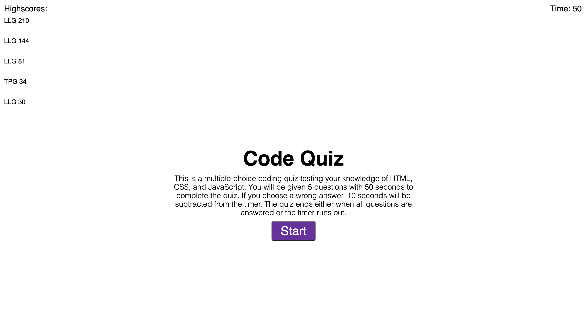

# code-quiz

Code quiz that tests the user on knowledge of HTML, CSS, and JavaScript concepts.

## Functionality

* User is presented with several multiple choice questions.

* Upon choosing correct answer, user score is increased.

* Upon choosing incorrect answer, time is subtracted from the timer.

* Game ends when timer runs out or all questions are answered.

* User can input initials at end of game; highscore is then saved and displayed.

## Features

* Dynamically created HTML elements.

* Utilization of local storage to save highscores.

## Link to Application

https://laurenlgoss.github.io/code-quiz/

## Screenshot of Application

### Home Screen

### Question Screen

## Developer Contact Information

* Phone: (828)409-3012

* [Email](laurenlgoss98@gmail.com)

* [LinkedIn](https://www.linkedin.com/in/laurenlgoss/)